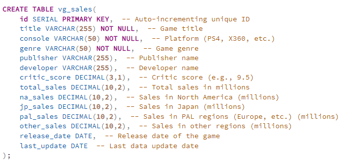
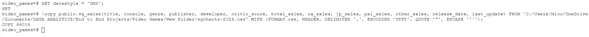
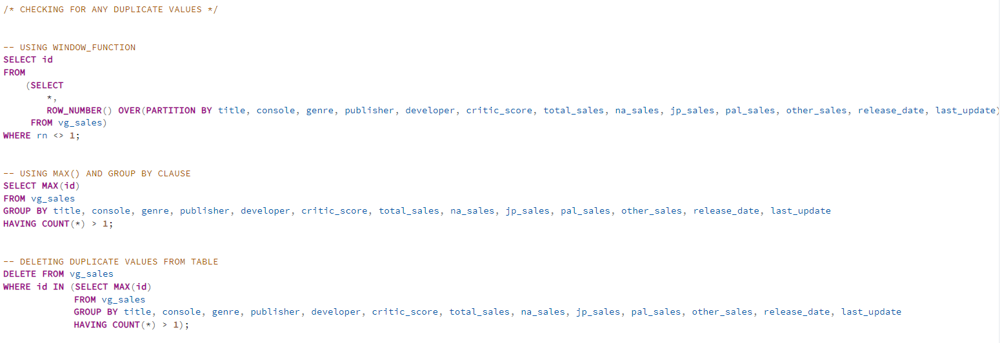
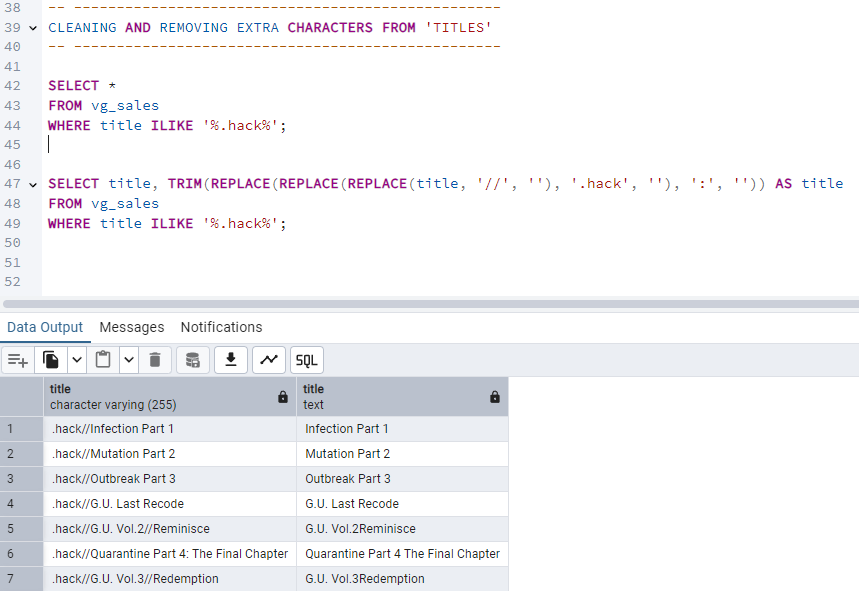
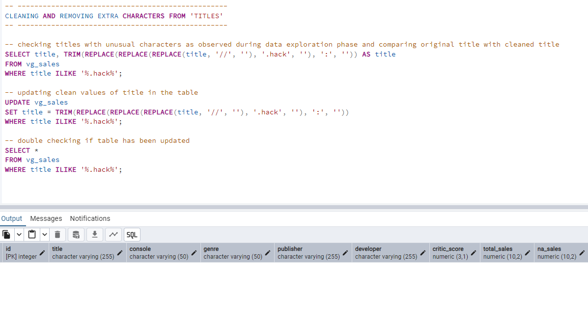
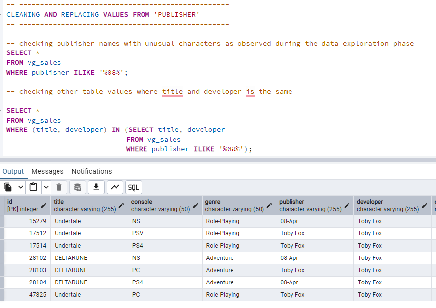
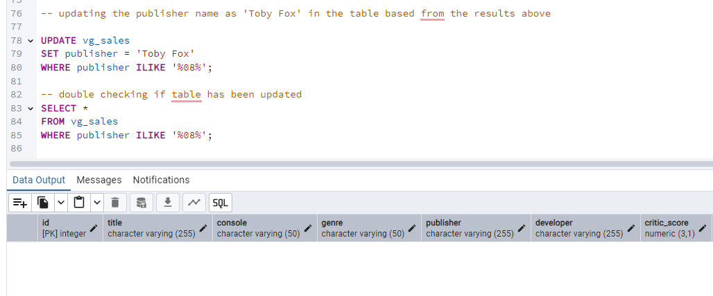
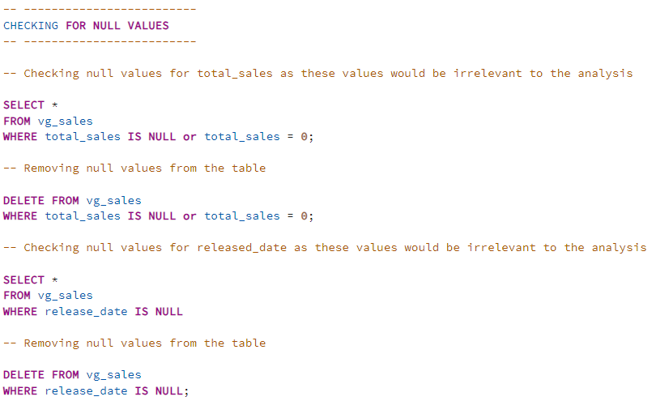

# SQL Project: Video Games Sales Analysis

# Overview

This SQL project focuses on exploring, cleaning, and transforming video game sales data using PostgreSQL. Through advanced SQL techniques—including joins, window functions, CTEs, GROUP BY, and subqueries—the dataset is thoroughly analyzed to uncover sales trends and identify key sales drivers. 


# Table of Contents

- [Objective](#objective)
- [Data Source](#data-source)
- [Stages](#stages)
- [Design](#design)
- [Development](#development)
  - [Process Outline](#process-outline)
  - [Data Extraction](#data-extraction)
  - [Data Exploration and Cleaning](#data-exploration-and-cleaning)
  - [Data Transformation and Manipulation](#data-transformation-and-manipulation)
  - [Data Modeling](#data-modeling)
- [Visualization](#visualization)
  - [Dashboard](#dashboard)
- [Analysis & Findings](#analysis-and-findings)
- [Recommendations](#recommendations)


# Objective

To analyze video game trends and identify factors that drive sales across platforms, regions, and genres, helping publishers and investors make smarter decisions and maximize success.


# Data Source

The [data](https://www.kaggle.com/datasets/asaniczka/video-game-sales-2024) is sourced from Kaggle (an Excel extract). The dataset consists of columns such as but not limited to:


| Column_Name | Description |
| --- | --- |
| title | Name of Video Game |
| console | Console where game is available |
| genre | Genre of Video Game |
| publisher | Publisher of Video Game | 
| criti_score | Numeric score of Video Game |
| total_sales | Global sales in millions |
| release_date |  Date of first release |


# Stages

- Data Import & Loading
- Data Exploration and Cleaning
- Data Transformation
- Analysis & Findings
- Recommendation


# Data Import & Loading


This is where the dataset was imported and loaded in PostgreSQL. 

1. To import the data, a table was created first.



2. Data was then inserted to the table using PSQL command.

 ```sql
-- =========================================================
PSQL command to insert the data into PostgreSQL
-- =========================================================

\copy public.vg_sales(title, console, genre, publisher, developer, critic_score, total_sales, na_sales, jp_sales, pal_sales, other_sales, release_date, last_update) FROM 'C:/Users/Mico/OneDrive/Documents/DATA ANALYTICS/End to End Projects/Video Games/New folder/vgchartz-2024.csv' WITH (FORMAT csv, HEADER, DELIMITER ',', ENCODING 'UTF8', QUOTE '"', ESCAPE '''');


```  




# Data Exploration and Cleaning

This is where the dataset was explored to get familiar with the data structure and data types, as well as to determine if there are any data anomalies such as missing or NULL values, duplicate rows and unusual characters that needs to be corrected. 

1. Checking and removing duplicates.



2. Checking and removing any unusual characters.

  - Titles





  - Publisher
     




3. Checking and removing any NULL values.
 


Additional Notes:

- Two null values in ‘developer’. The analysis will be based on the ‘publisher’, not the ‘developer’.
- Multiple null values in ‘critic score’. Trends of missing ‘critic score’ can be analyzed.
- Null values per ‘region’ are valid as some games may be sold in one region only or not in all regions
- Null values in ‘last update’ are valid since they indicate if a game has been updated or not.


# Data Transformation

After cleaning the data, this is where the cleaned data was tranformed to provide the required key metrics and answer key questions.   

## Key Performance Metrics

1. Total Sales: Sum of all video game sales

 ```sql
-- ----------------------------
	  	  Total Sales
-- ----------------------------

SELECT 
    SUM(total_sales) AS total_sales
FROM vg_sales;


```  

2. Regional Sales Distribution: Sales in NA, JP, PAL (Europe/Australia), and other regions.

 ```sql
-- ----------------------------------------
	    Regional Sales Distribution
-- ----------------------------------------

SELECT
	'North America' AS region,
	 SUM(na_sales) AS total_sales
FROM vg_sales
UNION ALL
SELECT
	'Japan' AS region,
	 SUM(jp_sales) AS total_sales
FROM vg_sales
UNION ALL
SELECT
	'Europe & Africa' AS region,
	 SUM(pal_sales) AS total_sales
FROM vg_sales
UNION ALL
SELECT
	'Rest of the World' AS region,
	 SUM(other_sales) AS total_sales
FROM vg_sales
ORDER BY total_sales DESC;


```  

3. Top-Selling Games: Best selling games of all time

 ```sql
-- ----------------------------------------
	    Top-Selling Games of All Time
-- ----------------------------------------

SELECT
	title,
	SUM(total_sales) AS total_sales
FROM vg_sales
GROUP BY title
ORDER BY total_sales DESC
LIMIT 10;


```

4. Platform Performance: Sales comparisons across consoles

 ```sql
-- -----------------------------------------
	 Best Performing Consoles of All Time 
-- -----------------------------------------

SELECT
	console,
	SUM(total_sales) AS total_sales
FROM vg_sales
GROUP BY console
ORDER BY total_sales DESC
LIMIT 10;


```


5. Genre Performance: Sales comparisons across genres

 ```sql
-- -----------------------------------------
	 Most Popular Game Genres by Sales
-- -----------------------------------------

SELECT
	genre,
	SUM(total_sales) AS total_sales
FROM vg_sales
GROUP BY genre
ORDER BY total_sales DESC
LIMIT 10;


```


6. Publisher Success: Total and average sales per publisher.

 ```sql
-- -----------------------------------------------
	 Sales Leaders: Best-Performing Publishers
-- -----------------------------------------------

SELECT
	publisher,
	SUM(total_sales) AS total_sales,
	ROUND(AVG(total_sales),2) AS avg_sales
FROM vg_sales
GROUP BY publisher
ORDER BY total_sales DESC
LIMIT 10;


```

7. Critic Score Impact: Correlation between critic scores and sales.

 ```sql
-- --------------------------------------------------
	 Critic Scores vs. Sales: Measuring the Impact
-- --------------------------------------------------

SELECT
	CASE
		WHEN critic_score BETWEEN 0 AND 2 THEN '0-2'
		WHEN critic_score BETWEEN 2 AND 4 THEN '2-4'
		WHEN critic_score BETWEEN 4 AND 6 THEN '4-6'
		WHEN critic_score BETWEEN 6 AND 8 THEN '6-8'
		ELSE '8-10'
	END AS critic_score_group,
	SUM(total_sales) AS total_sales,
	ROUND(AVG(total_sales),2) AS avg_sales
FROM vg_sales
WHERE critic_score IS NOT NULL
GROUP BY critic_score_group
ORDER BY critic_score_group;


```

8. Yearly Sales Trend: Sales comparison throughout the years.

 ```sql
-- -----------------------------
	 Video Game Sales Trends
-- -----------------------------

SELECT
	year,
	total_sales,
	SUM(total_sales) OVER(ORDER BY YEAR) AS running_total,
	COALESCE(LAG(total_sales) OVER(),0) AS prev_year_sales,
	CONCAT(ROUND((total_sales - LAG(total_sales) OVER())/LAG(total_sales) OVER(),2) * 100, '%') AS YoY_growth
FROM 
	(SELECT 
		EXTRACT(YEAR FROM release_date) AS year,
		SUM(total_sales) AS total_sales
	 FROM vg_sales
	 GROUP BY EXTRACT(YEAR FROM release_date)
	 ORDER BY YEAR) AS sq
;


```  
