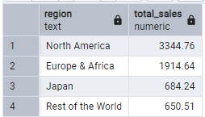

# SQL Project: Video Games Sales Analysis

# Overview

This SQL project focuses on exploring, cleaning, and transforming video game sales data using PostgreSQL. Through advanced SQL techniques—including joins, window functions, CTEs, GROUP BY, and subqueries—the dataset is thoroughly analyzed to uncover sales trends and identify key sales drivers. 


# Table of Contents

- [Objective](#objective)
- [Data Source](#data-source)
- [Stages](#stages)
- [Design](#design)
- [Development](#development)
  - [Process Outline](#process-outline)
  - [Data Extraction](#data-extraction)
  - [Data Exploration and Cleaning](#data-exploration-and-cleaning)
  - [Data Transformation and Manipulation](#data-transformation-and-manipulation)
  - [Data Modeling](#data-modeling)
- [Visualization](#visualization)
  - [Dashboard](#dashboard)
- [Analysis & Findings](#analysis-and-findings)
- [Recommendations](#recommendations)


# Objective

To analyze video game trends and identify factors that drive sales across platforms, regions, and genres, helping publishers and investors make smarter decisions and maximize success.


# Data Source

The [data](https://www.kaggle.com/datasets/asaniczka/video-game-sales-2024) is sourced from Kaggle (an Excel extract). The dataset consists of columns such as but not limited to:


| Column_Name | Description |
| --- | --- |
| title | Name of Video Game |
| console | Console where game is available |
| genre | Genre of Video Game |
| publisher | Publisher of Video Game | 
| criti_score | Numeric score of Video Game |
| total_sales | Global sales in millions |
| release_date |  Date of first release |


# Stages

- Data Import & Loading
- Data Exploration and Cleaning
- Data Transformation
- Analysis & Findings
- Recommendation


# Data Import & Loading


This is where the dataset was imported and loaded in PostgreSQL. 

1. To import the data, a table was created first.

 ```sql

CREATE TABLE vg_sales(
    id SERIAL PRIMARY KEY,  			-- Auto-incrementing unique ID
    title VARCHAR(255) NOT NULL,  		-- Game title
    console VARCHAR(50) NOT NULL,  		-- Platform (PS4, X360, etc.)
    genre VARCHAR(50) NOT NULL,  		-- Game genre
    publisher VARCHAR(255),  			-- Publisher name
    developer VARCHAR(255),  			-- Developer name
    critic_score DECIMAL(3,1),  		-- Critic score (e.g., 9.5)
    total_sales DECIMAL(10,2),  		-- Total sales in millions
    na_sales DECIMAL(10,2),  			-- Sales in North America (millions)
    jp_sales DECIMAL(10,2),  			-- Sales in Japan (millions)
    pal_sales DECIMAL(10,2),  			-- Sales in PAL regions (Europe, etc.) (millions)
    other_sales DECIMAL(10,2),  		-- Sales in other regions (millions)
    release_date DATE,  			-- Release date of the game
    last_update DATE  				-- Date of last data update
);


```  

2. Data was then inserted to the table using PSQL tool.

 ```sql
-- =========================================================
PSQL command to insert the data into PostgreSQL
-- =========================================================

\copy public.vg_sales(title, console, genre, publisher, developer, critic_score, total_sales, na_sales, jp_sales, pal_sales, other_sales, release_date, last_update) FROM 'C:/Users/Mico/OneDrive/Documents/DATA ANALYTICS/End to End Projects/Video Games/New folder/vgchartz-2024.csv' WITH (FORMAT csv, HEADER, DELIMITER ',', ENCODING 'UTF8', QUOTE '"', ESCAPE '''');


```  


# Data Exploration and Cleaning

This is where the dataset was explored to get familiar with the data structure and data types, as well as to determine if there are any data anomalies such as missing or NULL values, duplicate rows and unusual characters that needs to be corrected. 

1. Checking and removing duplicates.

 ```sql

-- USING WINDOW_FUNCTION
SELECT id
FROM
	(SELECT 
		*,
		ROW_NUMBER() OVER(PARTITION BY title, console, genre, publisher, developer, critic_score, total_sales, na_sales, jp_sales, pal_sales, other_sales, release_date, last_update) AS rn
	 FROM vg_sales)
WHERE rn <> 1;


-- USING MAX() AND GROUP BY CLAUSE
SELECT MAX(id)
FROM vg_sales
GROUP BY title, console, genre, publisher, developer, critic_score, total_sales, na_sales, jp_sales, pal_sales, other_sales, release_date, last_update
HAVING COUNT(*) > 1;


-- DELETING DUPLICATE VALUES FROM TABLE
DELETE FROM vg_sales
WHERE id IN (SELECT MAX(id)
			 FROM vg_sales
			 GROUP BY title, console, genre, publisher, developer, critic_score, total_sales, na_sales, jp_sales, pal_sales, other_sales, release_date, last_update
			 HAVING COUNT(*) > 1);


```  


2. Checking and removing any unusual characters.

  - Titles

 ```sql

-- --------------------------------------------------
CLEANING AND REMOVING EXTRA CHARACTERS FROM 'TITLES'
-- --------------------------------------------------		

-- checking titles with unusual characters as observed during data exploration phase and comparing original title with cleaned title
SELECT title, TRIM(REPLACE(REPLACE(REPLACE(title, '//', ''), '.hack', ''), ':', '')) AS title
FROM vg_sales
WHERE title ILIKE '%.hack%';

-- updating clean values of title in the table 
UPDATE vg_sales
SET title = TRIM(REPLACE(REPLACE(REPLACE(title, '//', ''), '.hack', ''), ':', ''))
WHERE title ILIKE '%.hack%';

-- double checking if table has been updated
SELECT *
FROM vg_sales
WHERE title ILIKE '%.hack%';


```  

  - Publisher
     
 ```sql

-- --------------------------------------------------
CLEANING AND REPLACING VALUES FROM 'PUBLISHER'
-- --------------------------------------------------	

-- checking publisher names with unusual characters as observed during the data exploration phase
SELECT *
FROM vg_sales
WHERE publisher ILIKE '%08%';

-- checking other table values where title and developer is the same 

SELECT *
FROM vg_sales
WHERE (title, developer) IN (SELECT title, developer
			     FROM vg_sales
			     WHERE publisher ILIKE '%08%');

-- updating the publisher name as 'Toby Fox' in the table based from the results above

UPDATE vg_sales
SET publisher = 'Toby Fox'
WHERE publisher ILIKE '%08%';

```


3. Checking and removing any NULL values.

 ```sql

-- Checking null values for total_sales as these values would be irrelevant to the analysis

SELECT *
FROM vg_sales
WHERE total_sales IS NULL or total_sales = 0;

-- Removing null values from the table

DELETE FROM vg_sales
WHERE total_sales IS NULL or total_sales = 0;

-- Checking null values for released_date as these values would be irrelevant to the analysis

SELECT *
FROM vg_sales
WHERE release_date IS NULL

-- Removing null values from the table

DELETE FROM vg_sales
WHERE release_date IS NULL;

Additional Notes:

- Two null values in ‘developer’. The analysis will be based on the ‘publisher’, not the ‘developer’.
- Multiple null values in ‘critic score’. Trends of missing ‘critic score’ can be analyzed.
- Null values per ‘region’ are valid as some games may be sold in one region only or not in all regions
- Null values in ‘last update’ are valid since they indicate if a game has been updated or not.

```


# Data Transformation

After cleaning the data, this is where the cleaned data was tranformed to provide the required key metrics and answer key questions.   

## Key Performance Metrics

**1. Total Sales: Sum of all video game sales**

 ```sql

SELECT 
    SUM(total_sales) AS total_sales
FROM vg_sales;


```


**2. Regional Sales Distribution: Sales in NA, JP, PAL (Europe/Australia), and other regions.**

 ```sql

SELECT
	'North America' AS region,
	 SUM(na_sales) AS total_sales
FROM vg_sales
UNION ALL
SELECT
	'Japan' AS region,
	 SUM(jp_sales) AS total_sales
FROM vg_sales
UNION ALL
SELECT
	'Europe & Africa' AS region,
	 SUM(pal_sales) AS total_sales
FROM vg_sales
UNION ALL
SELECT
	'Rest of the World' AS region,
	 SUM(other_sales) AS total_sales
FROM vg_sales
ORDER BY total_sales DESC;


```  




**3. Top-Selling Games: Best selling games of all time**

 ```sql

SELECT
	title,
	SUM(total_sales) AS total_sales
FROM vg_sales
GROUP BY title
ORDER BY total_sales DESC
LIMIT 10;


```


**4. Platform Performance: Sales comparisons across consoles**

 ```sql

SELECT
	console,
	SUM(total_sales) AS total_sales
FROM vg_sales
GROUP BY console
ORDER BY total_sales DESC
LIMIT 10;


```


**5. Genre Performance: Sales comparisons across genres**

 ```sql

SELECT
	genre,
	SUM(total_sales) AS total_sales
FROM vg_sales
GROUP BY genre
ORDER BY total_sales DESC
LIMIT 10;


```


**6. Publisher Success: Total and average sales per publisher.**

 ```sql

SELECT
	publisher,
	SUM(total_sales) AS total_sales,
	ROUND(AVG(total_sales),2) AS avg_sales
FROM vg_sales
GROUP BY publisher
ORDER BY total_sales DESC
LIMIT 10;


```


**7. Critic Score Impact: Correlation between critic scores and sales.**

 ```sql

SELECT
	CASE
		WHEN critic_score BETWEEN 0 AND 2 THEN '0-2'
		WHEN critic_score BETWEEN 2 AND 4 THEN '2-4'
		WHEN critic_score BETWEEN 4 AND 6 THEN '4-6'
		WHEN critic_score BETWEEN 6 AND 8 THEN '6-8'
		ELSE '8-10'
	END AS critic_score_group,
	SUM(total_sales) AS total_sales,
	ROUND(AVG(total_sales),2) AS avg_sales
FROM vg_sales
WHERE critic_score IS NOT NULL
GROUP BY critic_score_group
ORDER BY critic_score_group;


```


**8. Yearly Sales Trend: Sales comparison throughout the years.**

 ```sql

SELECT
	year,
	total_sales,
	SUM(total_sales) OVER(ORDER BY YEAR) AS running_total,
	COALESCE(LAG(total_sales) OVER(),0) AS prev_year_sales,
	CONCAT(ROUND((total_sales - LAG(total_sales) OVER())/LAG(total_sales) OVER(),2) * 100, '%') AS YoY_growth
FROM 
	(SELECT 
		EXTRACT(YEAR FROM release_date) AS year,
		SUM(total_sales) AS total_sales
	 FROM vg_sales
	 GROUP BY EXTRACT(YEAR FROM release_date)
	 ORDER BY YEAR) AS sq
;


```


## Key Requirements and Questions

**1. Which years saw record-breaking video game sales (>$100M)? What were the top 3 selling games during those years?**

 ```sql

-- extracting game sales per year
WITH yearly_sales AS (
	SELECT
		EXTRACT(YEAR FROM release_date) AS year,
		title,	
		total_sales
	FROM vg_sales
),

-- Calculating the sum of total sales per year and filtering years where total sales are higher than $100M
highestsales_year AS (
	SELECT 
		year,		
		SUM(total_sales) AS total_sales                
	FROM yearly_sales
	GROUP BY year
	HAVING SUM(total_sales) >= 100.0					
),

-- Ranking sales per year from highest to lowest
sales_ranking AS (
	SELECT
		year,
		title,
		total_sales,
		DENSE_RANK() OVER(PARTITION BY year ORDER BY total_sales DESC) AS rnk
	FROM yearly_sales
)

-- Main Query

SELECT
	sr.year,
	sr.title,
	sr.total_sales
FROM sales_ranking AS sr
INNER JOIN highestsales_year AS hs	   -- inner join to return matching columns from both tables
	ON hs.year = sr.year		   -- matched ON year to return only years where the sum of total sales > $100M
WHERE sr.rnk IN (1,2,3)			   -- filter to return only the top 1 to 3 selling games per year
ORDER BY sr.year;


```


**2. Which publishers have repeatedly produced the best-selling game of the year? Which games contributed to their success?**

 ```sql

-- Calculating the sum of total sales per year and title
WITH yearly_sales_title AS (
	SELECT 
		EXTRACT(YEAR FROM release_date) AS year,
		title,
		SUM(total_sales) AS overall_sales                     -- overall sales per year and game
	FROM vg_sales
	GROUP BY EXTRACT(YEAR FROM release_date), title
),

-- Ranking the games per year by overall_sales
ranking_overallsales_yearly AS (
	SELECT 
		year,
		title,
		overall_sales,
		DENSE_RANK() OVER(PARTITION BY year ORDER BY overall_sales DESC) AS rnk
	FROM yearly_sales_title
),

-- Respective publishers games with highest overall sales (Rank 1) every year 
top_publishers_yearly AS (
	SELECT
		ro.year,
		ro.title,
		vs.publisher,
		ro.overall_sales
	FROM ranking_overallsales_yearly AS ro
	INNER JOIN vg_sales AS vs
		ON ro.year = EXTRACT(YEAR FROM vs.release_date)
		AND ro.title = vs.title
	WHERE ro.rnk = 1
),

-- Number of times a publisher produced the best-selling game (Nested CTE)
count_appearances AS (
	SELECT
		publisher,
		COUNT(*) AS n_topcount
	FROM top_publishers_yearly
	GROUP BY publisher
)

-- Main Query

SELECT DISTINCT
	tp.publisher,			      -- return the publisher
	tp.title,			      -- return all the game titles that the publisher produced
	tp.year,			      -- return the year when the game was published
	tp.overall_sales 		      -- overall_sales of the game, which is the max sales for that year
FROM top_publishers_yearly AS tp
LEFT JOIN count_appearances AS ca	      -- Inner join to return matching columns from both tables
	ON tp.publisher = ca.publisher	      -- Matched ON publisher to return only those that will match the filter
WHERE ca.n_topcount > 1		              -- Return only publishers who produce the best-selling game more than once
ORDER BY tp.publisher, tp.year;


```


**3. What are the highest-grossing games that launched on multiple consoles, and which platform generated the highest sales?**

 ```sql

-- Highest-grossing games that are available on multiple consoles
WITH multiplatform_games AS (
	SELECT 
		title,
		SUM(total_sales) AS combined_sales,		          -- Overall sum of a game's total sales across all consoles
		COUNT(DISTINCT console) AS n_consoles                     -- Count of distinct consoles where the game is available
	FROM vg_sales
	GROUP BY title
	HAVING COUNT(DISTINCT console) > 1                                -- Filter games that are available in more than 1 console
),

-- Returning the most profitable console per game 
top_console AS (
	SELECT
		title,
		console,						  -- Return the console for the highest sales per game
		total_sales
	FROM vg_sales
	WHERE (title, total_sales) IN (SELECT title, MAX(total_sales)     -- Filter only for the maximum sales per game     
	                               FROM vg_sales
				       GROUP BY title)
),

-- Extracting games with the list of consoles where they are available
consoles_list AS (
	SELECT 
		title,
		ARRAY_AGG(DISTINCT console) AS consoles_available         -- Returns a list of distinct consoles where each game is available
	FROM vg_sales
	GROUP BY title
)

-- Main Query

SELECT 
	m.title,
	c.consoles_available,
	t.console AS top_console,
	t.total_sales AS top_console_sales,
	m.combined_sales AS combined_console_sales
FROM multiplatform_games AS m
INNER JOIN top_console AS t						   -- Inner join since there may be games with max sales that are not multiplatform games
	ON m.title = t.title						   -- Joined ON title to return the same game from top_console and multiplatform_game
INNER JOIN consoles_list AS c
	ON m.title = c.title						   -- Joined ON title to return the same game from top_console and consoles_list
ORDER BY m.combined_sales DESC
LIMIT 10;           


```


**4. How do multiplatform games impact the overall sales of a publisher compared to single-platformed games?**

 ```sql

-- Overall sales per publisher
WITH overall_sales AS (
	SELECT
		publisher,
		SUM(total_sales) AS overall_sales							
	FROM vg_sales 
	GROUP BY publisher
),

-- sales of single and multi-platformed games per publisher
div_sales AS (
	SELECT
		publisher,
		title,
		SUM(total_sales) AS total_sales,		           -- Overall sum of a game's total sales across all consoles
		COUNT(DISTINCT console) AS n_consoles                      -- Count of distinct consoles where the game is available
	FROM vg_sales
	GROUP BY publisher, title					   -- Grouped by publisher then title to segregate sales and count for single and multi-platformed games
),
singleplatform_sales AS (
	SELECT
		publisher,
		SUM(total_sales) AS total_single_sales			   -- Total sales of single platform games per publisher 
	FROM div_sales
	WHERE n_consoles = 1						   -- Filter single platform games
	GROUP BY publisher
),
multiplatform_sales AS (
	SELECT
		publisher,
		SUM(total_sales) AS total_multi_sales			   -- Total sales of multi-platform games per publisher
	FROM div_sales
	WHERE n_consoles > 1						   -- Filter multi-platform games
	GROUP BY publisher
)


SELECT
	o.publisher,
	CONCAT(ROUND((s.total_single_sales / o.overall_sales) * 100, 2), '%') AS perc_singleplatform_games,        -- sales of single platform games / overall sales (per publisher)
	CONCAT(ROUND((m.total_multi_sales / o.overall_sales) * 100, 2), '%') AS perc_multiplatform_games,	   -- sales of multi-platform games / overall sales (per publisher)
	o.overall_sales												   -- overall sales per publisher
FROM overall_sales AS o
INNER JOIN singleplatform_sales AS s ON o.publisher = s.publisher						   -- Inner join to return publishers with both single and multi-platform games																				 
INNER JOIN multiplatform_sales AS m ON o.publisher = m.publisher						   -- Inner join to return publishers with both single and multi-platform games																		
ORDER BY o.overall_sales DESC
LIMIT 20;


```


**5. How often do critic scores align with sales? Which top-rated games struggled commercially, and which low-rated games still sold remarkably well?**

 ```sql

-- Highly-rated (critic_score: 8-10)
-- Low-rate (critic_score: 1-4)

WITH game_critic_sales AS (
	SELECT
		title,
		ROUND(AVG(critic_score),2) AS avg_critic_score,					-- AVG critic score across all consoles 
		SUM(total_sales) AS total_sales						            -- Sum of total sales across all consoles
	FROM vg_sales
	WHERE critic_score IS NOT NULL											-- filter games with available critic_score only
	GROUP BY title
),
avg_sales AS (
    SELECT AVG(total_sales) AS overall_avg_sales 					        -- Avg sales of games with avaialble critic scores
	FROM game_critic_sales
)


SELECT
	title,
	avg_critic_score,
	total_sales,
	CASE 
        WHEN avg_critic_score <= 4 AND total_sales > overall_avg_sales 
            THEN 'Low-rated High Sales'
        WHEN avg_critic_score >= 8 AND total_sales < overall_avg_sales
            THEN 'High-rated Low Sales'
        ELSE NULL
    END AS category
FROM game_critic_sales, avg_sales											 -- cross join of a scalar value (implicitly joins every single row)
WHERE (avg_critic_score <= 4 AND total_sales > overall_avg_sales) OR
	  (avg_critic_score >= 8 AND total_sales < overall_avg_sales)
ORDER BY avg_critic_score DESC;


```


**6. Which best-selling games have remained relevant over time, and does the critic score play a role in their longevity?**

 ```sql

-- total sales per game
WITH game_sales AS (
	SELECT
		title,
		SUM(total_sales) AS total_sales
	FROM vg_sales
	GROUP BY title
),

-- years between release and update dates
update_years AS (
	SELECT 
		title,
		DATE_PART('year', last_update) - DATE_PART('year', release_date) AS years_afterlaunch_update          -- difference in years between update and release dates
	FROM vg_sales
),

-- average critic score per game across all consoles
game_avg_critic_scores AS (
	SELECT 
		title,
		ROUND(AVG(critic_score), 2) AS avg_critic_score				
	FROM vg_sales
	GROUP BY title
)

-- Main Query

SELECT DISTINCT 
	u.title,
	g.total_sales,
	u.years_afterlaunch_update,						-- difference in years between last_update and release_date
	a.avg_critic_score                                                 	-- average critic score per game across all consoles
FROM update_years AS u
LEFT JOIN game_sales AS g
	ON u.title = g.title
LEFT JOIN game_avg_critic_scores AS a
	ON a.title = u.title
WHERE a.avg_critic_score IS NOT NULL AND years_afterlaunch_update >= 3		-- excluding games with no critic_scores and including update years of 3 or more years
ORDER BY total_sales DESC
LIMIT 10;


```


**7. How do gaming preferences differ across different regions? Which genres lead in sales for each region?**

 ```sql

WITH regional_genre_sales_count AS (
	SELECT
		'North America' AS region,					-- Region category
		genre,
		SUM(na_sales) AS total_sales,					-- Sum of sales per genre in North America
		COUNT(DISTINCT title) AS n_genres				-- Count of distinct titles per genre in North America (since some titles are available on multiple consoles)
	FROM vg_sales
	WHERE na_sales IS NOT NULL
	GROUP BY genre

UNION ALL									-- Union All to return all rows

	SELECT
		'Japan' AS region,
		genre,
		SUM(jp_sales) AS total_sales,
		COUNT(DISTINCT title) AS n_genres
	FROM vg_sales
	WHERE jp_sales IS NOT NULL
	GROUP BY genre

UNION ALL

	SELECT
		'Europe & Africa' AS region,
		genre,
		SUM(pal_sales) AS total_sales,
		COUNT(DISTINCT title) AS n_genres
	FROM vg_sales
	WHERE pal_sales IS NOT NULL
	GROUP BY genre

UNION ALL

	SELECT
		'Rest of the World' AS region,
		genre,
		SUM(other_sales) AS total_sales,
		COUNT(DISTINCT title) AS n_genres
	FROM vg_sales
	WHERE other_sales IS NOT NULL
	GROUP BY genre
)

-- Main Query

SELECT	
	region, genre, total_sales, n_genres
FROM
	(SELECT 
		*,
		DENSE_RANK() OVER(PARTITION BY region ORDER BY total_sales DESC) AS rnk        -- ranks total_sales per region in descending order 
	FROM regional_genre_sales_count
	) AS sq
WHERE rnk <= 3;										       -- returns top 3 genres per region


```


